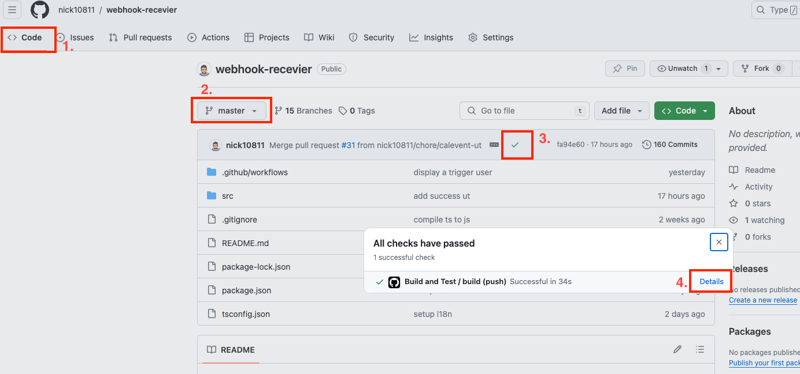

# WEBHOOK-RECEIVER

## Description
The project is a webhook receiver that enables users to book an event on [Cal.com](https://cal.com/) through text messages on the LINE bot and store the event information on Google Sheets. It integrates with the LINE messaging API and Cal.com API. The project is built using Node.js and TypeScript and is designed to be deployed on AWS Lambda. The architecture of the project is based on the MVC pattern.

## Prerequisites
- [Node.js](https://nodejs.org/en/download/current) (v20 and above)
- [npm](https://www.npmjs.com/get-npm)
- [ngrok](https://ngrok.com/download) (optional)

## Directory Structure
```
.
├── build/ (build output)
├── out/ (output)
│   │── artifact/archive.zip (archived project)
│   └── report/ (test report and coverage)
├── src/
│   ├── config/
│   │   │── config.ts (configuration)
│   │   └── handled_line_text.json (handled LINE text)
│   ├── controller/
│   ├── locale/ (localization)
│   ├── model/
│   ├── service/
│   ├── template/ (LINE reply message templates)
│   └── index.tsx (main function)
├── package.json (project absctract)
├── README.md
└── tsconfig.json (typescript configuration)
```

## Development
- Set `.env` file with the following variables:
  > **INFO:** you can read [./src/config/config.ts](./src/config/config.ts) for more information
  ```
  ENVIRONMENT=dev
  PORT=3000
  CHANNEL_ID=line_channel_id
  CHANNEL_SECRET=line_channel_secret
  CHANNEL_ACCESS_TOKEN=line_channel_access_token
  GOOGLE_SERVICE_ACCOUNT_EMAIL=google_service_account_email
  GOOGLE_PRIVATE_KEY=google_private_key
  BOOKING_URL=calcom_event_url
  ```
  
- Run `npm install` to install dependencies.
- Run `npm run build` to build the project.
- Run `npm start` to start the server.
- Run `npm run clean` to clean the output directories.

### ngrok (optional)
ngrok is a tool that allows you to expose a web server running on your local machine to the internet. This is useful for testing webhooks locally.
- Download and install ngrok from [here](https://ngrok.com/download).
- Sign up for an account and get your auth token from [here](https://dashboard.ngrok.com/get-started/setup).
- Authenticate your account by running `ngrok authtoken <your_auth_token>`.
- Run `ngrok http 3000` to expose the server to the internet.

### Webhook URL
The project provides two webhook URLs:
- https://www.example.com/linewebhook
- https://www.example.com/calwebhook

with language support:
- https://www.example.com/linewebhook?lang=en
- https://www.example.com/linewebhook?lang=zh-TW
- https://www.example.com/linewebhook?lang=jp

## Testing
The project utilizes the [Vitest](https://vitest.dev/) testing framework for unit testing and code coverage.
- Run `npm run test` to run the test cases.
- Run `npm run test:report` to generate the test report and coverage.
  > The output will be generated in the `./out/report` directory. Open `index.html` to view the report.

## Deployment
The project is designed to be deployed on AWS Lambda. The deployment process involves building the project, archiving the project, and uploading the archive to the Lambda function.

### Archiving
- Run `npm run build` to build the project.
  > The output will be generated in the `./build` directory.
- Run `npm run archive` to archive the project.
  > The archived file, `out/artifact/archive.zip`, will be generated.

### Upload to AWS Lambda
- Create a new Lambda function in the AWS console.
- Upload the `archive.zip` file to the Lambda function.

## CI/CD
The project also provide an automatic approach to build and deploy the project using GitHub Actions. The CI/CD pipeline is configured in the `.github/workflows` directory. We separate the pipeline into two workflows:
- `buildspec_ci.yml` (CI Pipeline)
- `buildspec_cd.yml` (CD Pipeline)

### Secrets and Environment Variables
[Create secrets](https://docs.github.com/en/actions/security-guides/using-secrets-in-github-actions#creating-secrets-for-a-repository) and environment variables in the GitHub repository settings. The following secrets and environment variables are required to run the CI/CD pipeline:
- `AWS_ACCESS_KEY_ID`
- `AWS_SECRET_ACCESS_KEY`

> **INFO:** To obtain credentials for the AWS account, refer to the [AWS documentation](https://docs.aws.amazon.com/keyspaces/latest/devguide/access.credentials.html#access.credentials.IAM).

### CI Pipeline
The workflow is triggered for every pull request merged into the `master` branch. It is advisable to activate it through pull requests to ensure the code quality before merging it into the `master` branch, rather than directly pushing changes to the `master` branch. 

The build results will automatically be commented on the pull request, along with a link to the [workflow run-id](https://github.com/orgs/community/discussions/26965#discussioncomment-3254141). Users can click on the link to view the workflow details, which include an archive of the project and a report of the test cases and coverage.

### CD Pipeline
This workflow is triggered manually by pushing a specific branch. Upon triggering, the workflow downloads a specific archive and deploys it to the AWS Lambda function.

#### Obtain the Workflow Run ID of the CI Pipeline
There are two ways to obtain the workflow run-id:

- **On the Pull Request**

  If you are on the pull request page, you can find the workflow run-id in the comment section.

- **Merged to Master**
  
  If you have already merged the pull request, you can follow these steps:
  1. Go to the main page of the repository.
  2. Switch to the `master` branch.
  3. Click the green checkmark icon on the top.
  4. Click the Details link on the CI pipeline, **Build and Test/ build (push)**.
  5. Copy the [workflow run-id](https://github.com/orgs/community/discussions/26965#discussioncomment-3254141) from the URL.
      - pattern: https://github.com/{owner}/{repo}/actions/runs/{workflow-run-id}



#### Push a New Deploy Branch
The CD pipeline is triggered by pushing a new branch with the following pattern:
- deploy/{region}/{lambda-function-name}/{workflow-run-id}
- examples: 
  - deploy/ap-northeast-1/line-bot/8964697943

## Author
- [Nick Yang](https://github.com/nick10811)